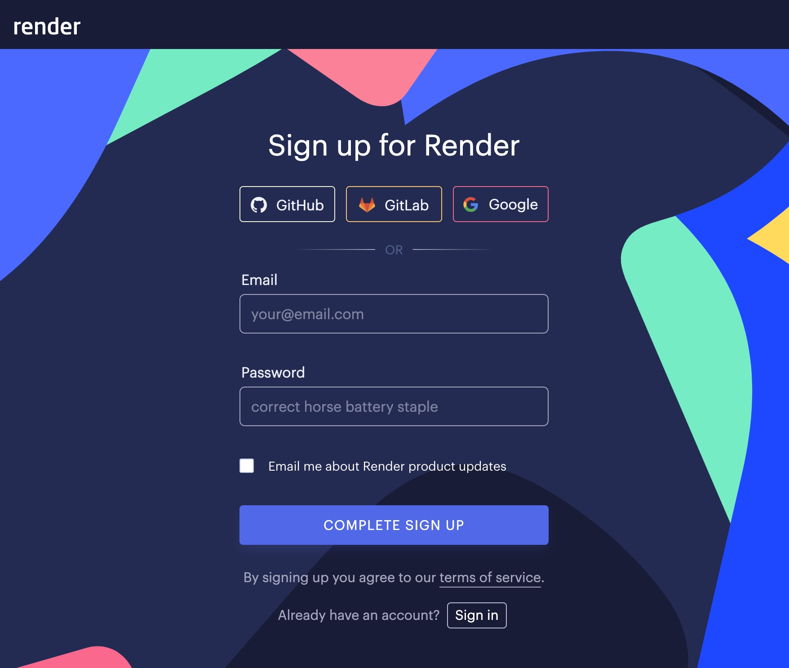
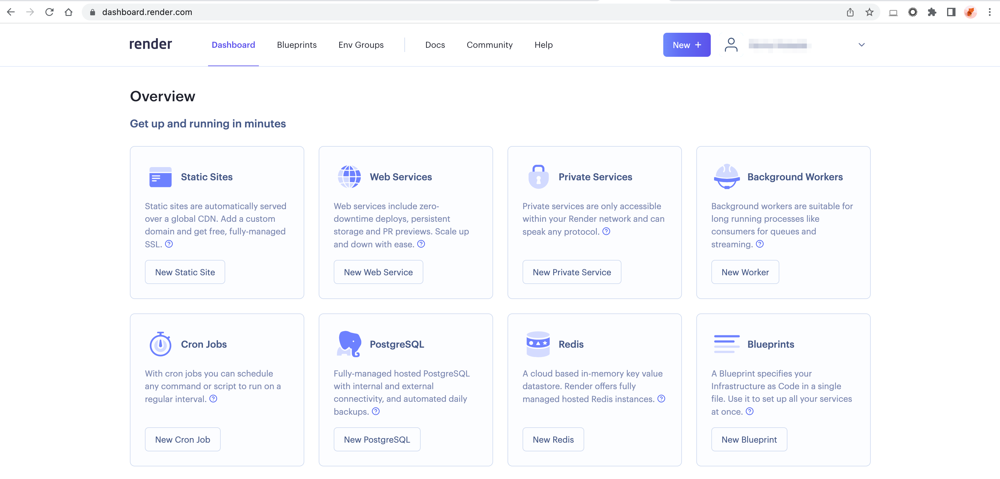
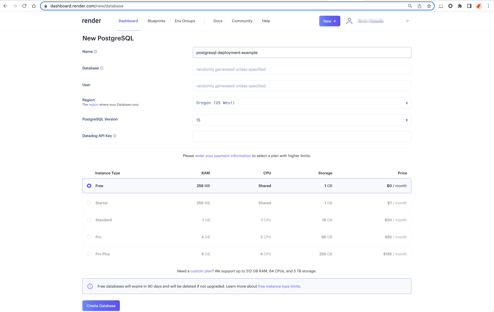
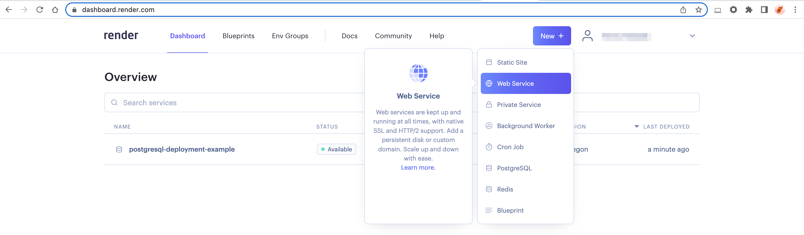
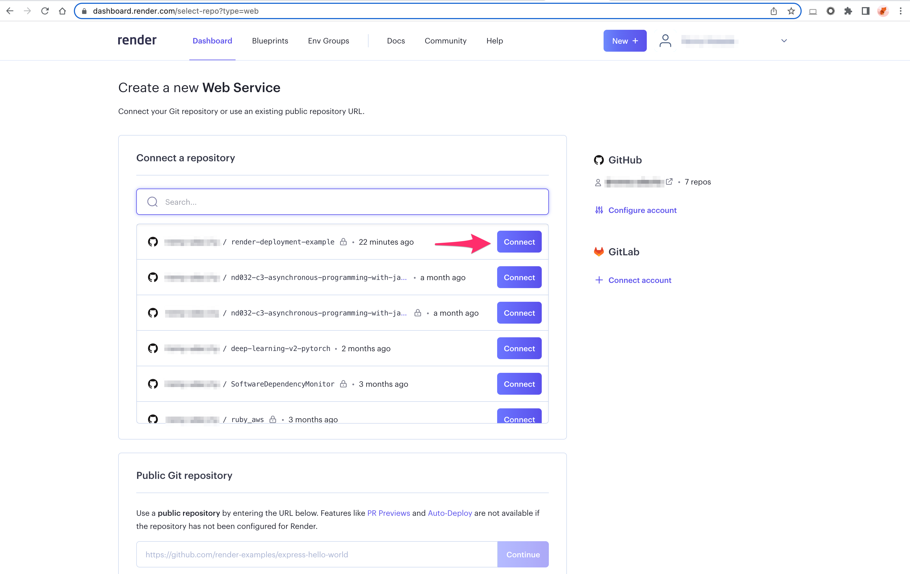
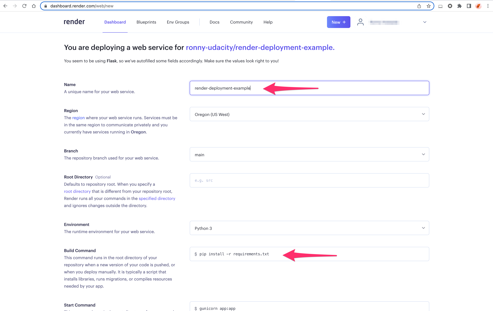
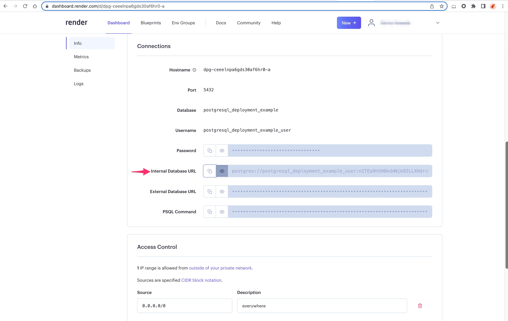
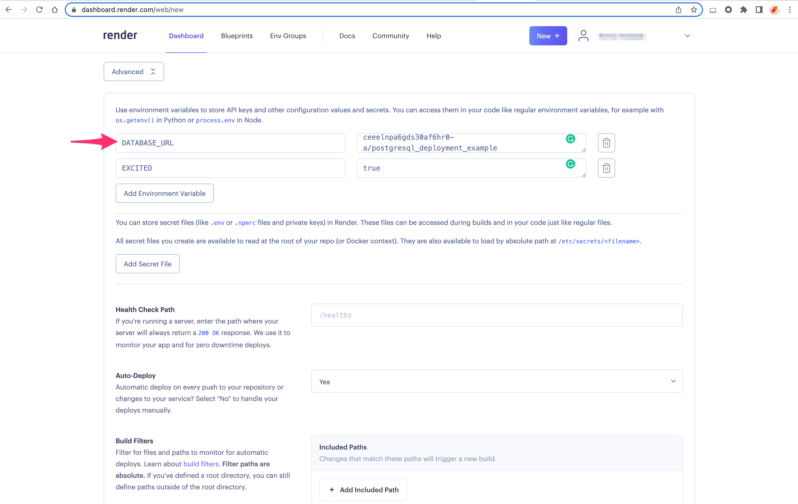
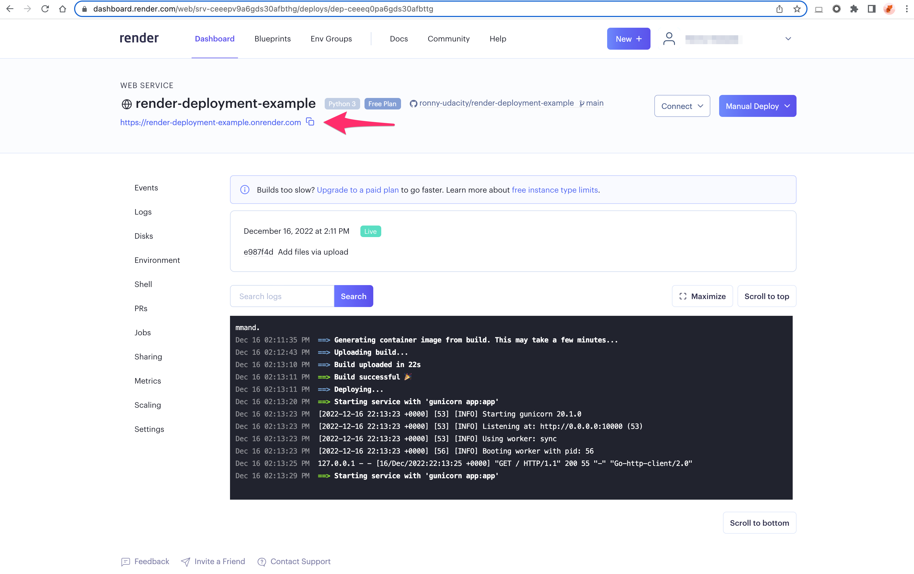

### Introduction to Render Cloud Platform
### 1. Create a Render Account
From the Render.com landing page, click the "Get Started" button to open the [sign-up page](https://dashboard.render.com/register). You can create an account by linking your GitHub, GitLab, or Google account or provide your email and password.

### 2. Set up a Database Service with Postgres
Once you are logged in, you will be redirected to the Render Dashboard. Click the `New Postgres` button to set up a Postgres cloud database.

On the "New Postgres" page:

1. Provide a name for the new database service: postgres-deployment-example
2. Select an instance type: Free
3. Click Create Database button

### 3. Deploy Apps with Render's Web Service
Once the database is set up, we can go back to Render Dashboard and create a new Web Service.

Connect your Flask app from GitHub or GitLab repo to the Web Service

On the "New Web Service" page:

1. Provide a name for the new database service: `render-deployment-example`
1. Select an instance type: `Free`
2. Enter the build command: `pip install -r requirements.txt`

Note: Render will install the dependencies from the "requirements.txt" provided in the GitHub repo.

### Connect the Database Service and Web Service
Before you click `Create Web Service`, you will need to connect the Postgres service so your Flask app can read and write data to the Postgres database. To connect the services, you can copy the Postgres database URL and paste it into the environment variables within the web service

#### Copy Postgres Database URL
From the Postgres service (name: "postgres-deployment-example"), click the "Info" side navigation and copy the `Internal Database URL` from the Connections page.

#### Paste the Database URL in the Web Service Environment Variable
From the web service (name: "render-deployment-example"), create an environment variable with the key: `DATABASE_URL` and value: `the <Database URL> copied from the Postgres service`.

Note: The Flask app will use the second environment variable ("EXCITED: true"). You can store any other credentials for your apps by adding the environment variables.

After the Web Service is ready, you can open your Flask app on the browser by clicking the App URL.

](image-8.png)

And my result:

After you complete this exercise, please suspend or delete the services to avoid any charges.